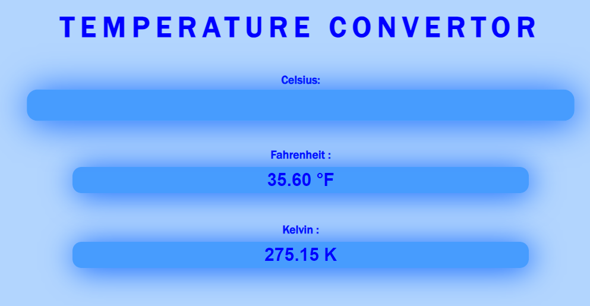
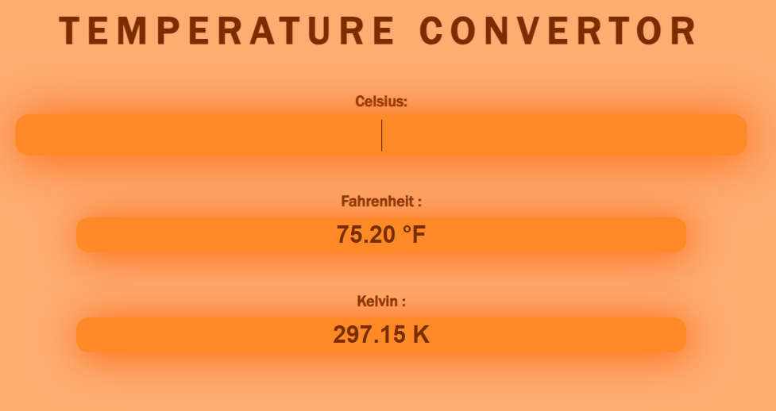
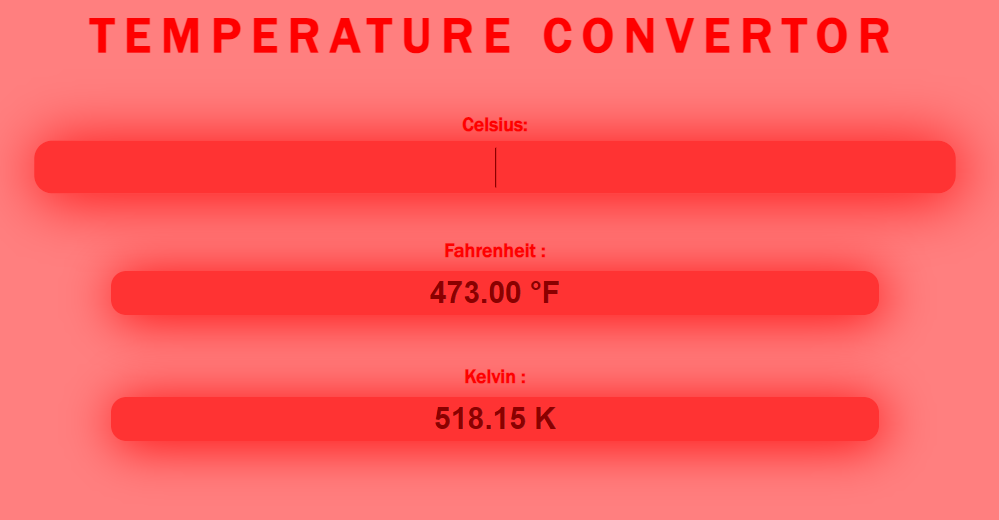

# Temperature Converter
## Bharat Intern task 2

This is a simple web-based temperature converter that allows users to convert temperatures between Celsius, Fahrenheit, and Kelvin. It provides real-time conversion as you type and features dynamic styling based on the input temperature.

## Features

- Convert temperatures between Celsius, Fahrenheit, and Kelvin.
- Dynamic styling based on the input temperature.
- Real-time updates as you type.
- Ignores alphabets typed.

## Demo
[Click here to check it out for yourself](https://brilliant-griffin-628ff1.netlify.app)

## Screenshots

